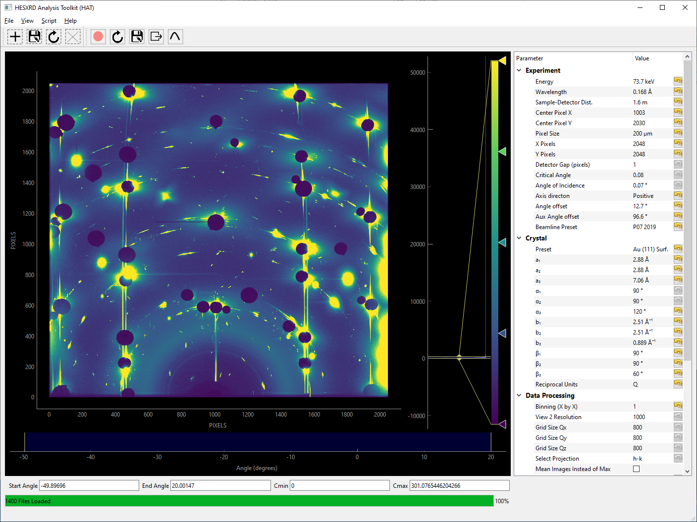
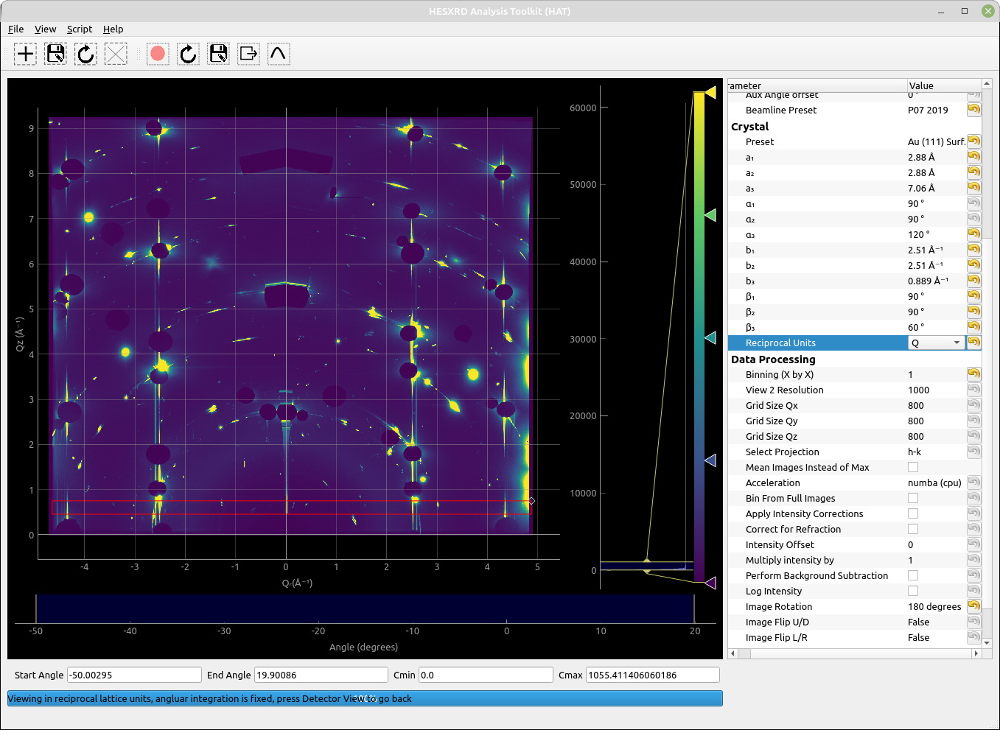
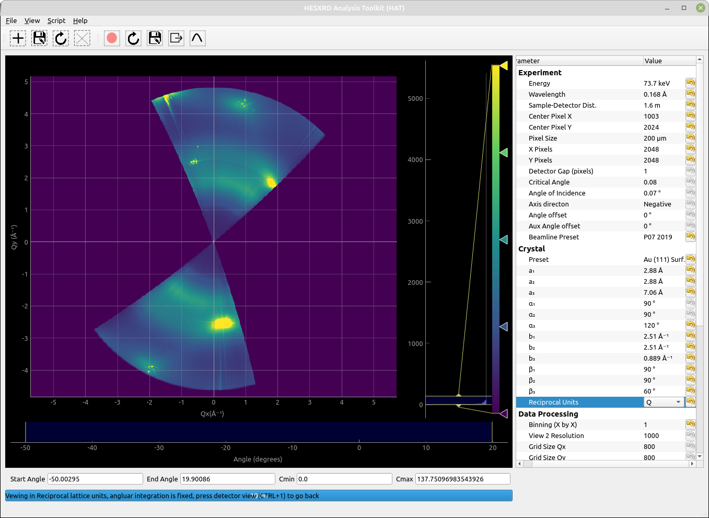
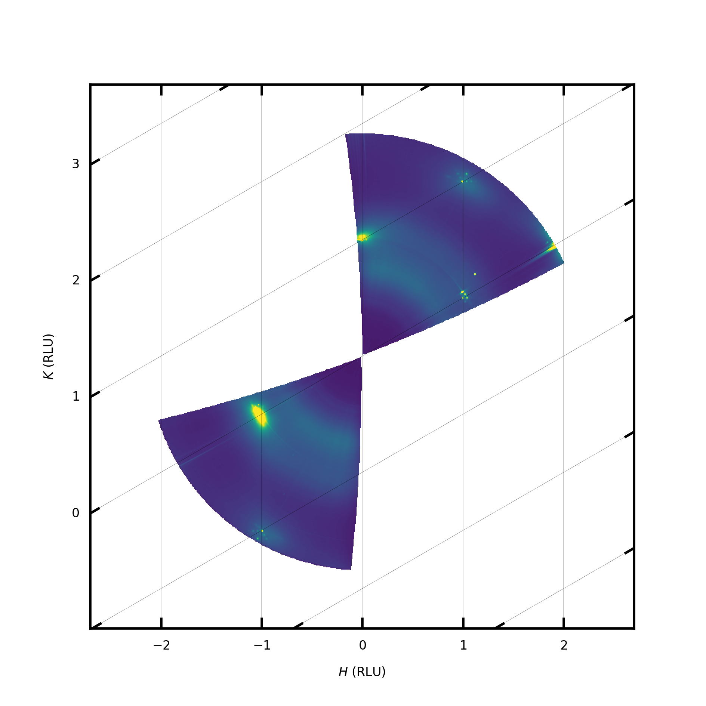
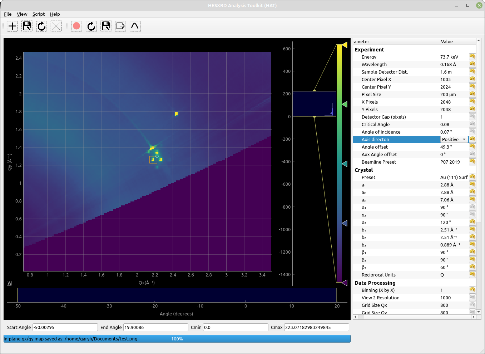
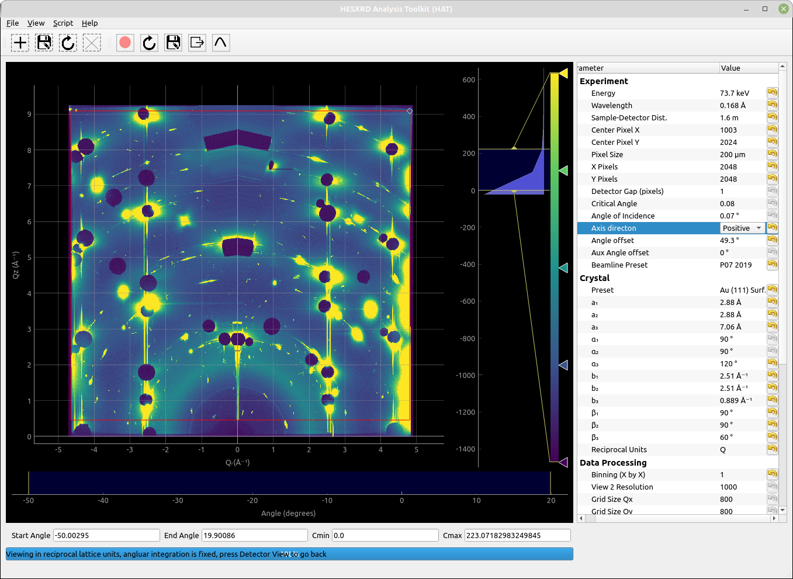

Beginner tutorial
=====================================
This tutorial will introduce some of the basic functionalities of HAT and generate some basic plots for a Au(111) surface in surface reciprocal lattice units.

.. toctree::
 :maxdepth: 1

Downloading and extracting example dataset
````````````````

An example dataset can be downloaded from the following addesss:

https://figshare.com/articles/dataset/Au_111_in_NaOH_High-energy_surface_x-ray_diffraction_dataset/20160632

The files are compressed with the 7zip format, in windows you will need software that can extract such files. Such a tool can be downloaded from here:

https://www.7-zip.org/download.html

In linux the following terminal command will download the dataset.

``wget https://figshare.com/ndownloader/files/36048185``

 in linux you can usually use the 7za command to uncompress the file. Firstly check it is available::

  whereis 7za
  7za: /usr/bin/7za /usr/share/man/man1/7za.1.gz
  
You should then extract the data using the following command (replacing the number by the actualy filename):
 
``7za e ./36048185``

If it isn't found then you need to install it.

Install p7zip to unzip *.7z files on Debian and Ubuntu
......

``$ sudo apt-get install p7zip``

Install p7zip to unzip *.7z files on Fedora
......

``$ yum install p7zip``


Loading the data
````````````````
Start HAT, if you installed hat with pip (and you're in the correct enviroment) then at the terminal you can simply type:

``xrayhat``

Otherwise from the source directory you can run (you mayneed to replace python with python3):

``python main.py``

Next you should change the beamline preset in the parameter tree (right side of the window) to P07 2019. It is generally recommend you use the manual beamline preset as beamlines seem to be constantly chaning their file formats and HAT is unlikely to keep up. However, the chosen preset is known to work with this data. 

Next click on |File -> Select Data Images| and then find and select the .TIF images that you should have extracted above.

They should have names such as: "au_111_naoh_2_00023-00001.tif", one of the files is a dark image and this can be ignored. The compressed archive also contains .metadata files for each image, the P07 2019 preset will automatically handel this metadata. In particular it will read the angle values and an intensity monitor value. 

Next several parameters should be chosen under Experiment in the parameter tree.
The energy = 73.7 keV
Sample-Detector Dist. = 1.6m

Center Pixel X = 1003
Center Pixel Y = 2024

The number of pixels and size the pixel should be chosen correctly since we alreay selected the correct preset. The angle offset is to be determined later. But we no from the experimental geomtery that the direction is negative. 

Under crystall we can choose the Au(111) preset since the data was collected from a Au(111) sample. These will set the lattice parameters to the correct values for Au(111) in surface coordinates. 

In Data Proccessing we should select 180 degrees for Image rotation as the images are rotated. The binning value will depend on how much system RAM  is available, but since we are only quickly exploring the data - setting it to value of 4 or higher is a good idea.

Unless you know you have a GPU that is correctly setup acceleration should be set to "Numba (cpu)"

Now we can load the data, although it could be a good idea to save the file selection and parameters first so you can restore them if needed (File -> Quick Save). 

To load the data click on (File -> Load)


Detector View
````````````````
While the images are loading the view will update after every 100 images. After loading you should have a view that looks like the screenshot below. This is called the detecor view mode and can be accessed at anytime by clicking (View -> Detector View) or pressing CTRL+1.




In this view the image is construsted from maximum intensity of each pixel accross the whole rotation. If instead you'd like the average intensity across the whole rotation you can do this by selecting "Mean Images instead of Max" under Data Processing in the parameter tree. 

From the toolbar, masks can be added. Mask are attached the view they are created in, for detector view the masks are exclusionary and can be used to reject pixels from later binning. This could be useful for excluding gaps between detector pixels or areas of the detector that are covered. 

If the "Toggle ROI" button is pressed on the toolbar a box profile is created and the profile shown in a panel below the detector view. The profile runs between the two draggable circles. "Save ROI" will save the shape and position of the ROI vox so the same profile can be used for multiple datasets. "Extract ROI" will save the profile to a csv file.

Transformed Detector View
````````````````
Since the HAT GUI currently doesn't support displaying in non-rectangular, we will need to work in Q units so the in-plane project we generate wont look distored. You can choosen this under "Reciprocal Units" in the parameter bar under Crystal. 

Next click the View menu and choose "Transformed Detector View" (ctrl+2). The current view will then be distored and have units on the axis as in the screenshot below.



This view is our first opprtunity to select pixels to be included in any subsequent binning. Initally we want to make an in-plane map to find the orientation of the sample, so create a mask that selects a slice along Qr as shown in the screenshot. 

Next check that "h-k" is selected under "Select Projection"in the Data Processing section of the parameter menu.

We are going to create a projection of the selected slice on the Qx/Qy plane. Make sure there is sensible number chosen for the Qx and Qy gridsize (under Data Processing), 800 is a good number to start with.

Then Press: View -> Binned Projection (or ctrl+3)

Binned Projection
````````````````
The view you get should now look something like the screenshot below:



This is probably a little distored since we have no idea about the sample orientation at this point, it's made harder to tell if the orientation is correct as we are using Q units. Therefore, we would like to plot this in-plane view in reciprocal lattice units (RLU) to see where the rods fall. For a hexagonal unit cell such as Au(111) we can can use the plotting.py interface. 

First you need to find where you installed the xrayhat package and located the file plotting.py. If you created a new enviroment on linux it will be somewhere like:

``<path to enviroment>/lib/python3.8/site-packages>/xrayhat/``

On windows or an anaconda installation it will be somewhere else. The easiest way to locate it is launching python from the terminal and doing something like this::

   Python 3.8.y
    [GCC 4.x] on linux
    Type "help", "copyright", "credits" or "license" for more information.
    >>> import xrayhat
    >>> xrayhat.__file__
    '/home/garyh/pyenvs/hat/lib/python3.8/site-packages/xrayhat/__init__.py'

The default plotting.py file is already setup to plot what we want, but in case it is missing you want to do something like below::

 def plot_projection_hk(hat, grid_h,grid_k,grid_i,cmin,cmax, outfile_name):  
     
     #define transformation for hexagonal coordinates
     b1 = hat.crystal.param('b₁').value()
     def tr(h, k):
         h, k = np.asarray(h), np.asarray(k)
         return (np.sqrt(3)/2)*h*b1,(k+0.5*h)*b1

     def inv_tr(x, y):
         x, y = np.asarray(x), np.asarray(y)
         return (x/(np.sqrt(3)/2))/b1,(y-0.5*x)/b1   


     plt.rcParams.update({'font.size': 4})
     plt.rc('legend', fontsize=8, handlelength=2)
     plt.rcParams.update({'font.sans-serif': 'Arial'})
     cm = 1/2.54  # centimeters in inches

     fig = plt.figure(figsize=(8*cm,8*cm),dpi=600)

     grid_helper = GridHelperCurveLinear((tr, inv_tr),grid_locator1=FixedLocator([-3,-2,-1,0,1,2,3]),grid_locator2=FixedLocator([-3,-2,-1,0,1,2,3]))

     ax1 = Subplot(fig, 1, 1, 1, grid_helper=grid_helper)
     #ax1 = Subplot(fig, 1, 1, 1,)
     fig.add_subplot(ax1)
     grid_i = grid_i.T.astype(float)
     grid_i[grid_i <= 1] = np.nan  

     tmp = ax1.imshow(grid_i, extent=(np.min(grid_h),np.max(grid_h),np.min(grid_k),np.max(grid_k)), origin='lower',vmin=cmin,vmax=cmax,cmap='viridis',interpolation='gaussian')  

     ax1.grid(True,linewidth=0.05,color='black')
     ax1.xaxis.set_major_locator(ticker.MultipleLocator(1))
     ax1.yaxis.set_major_locator(ticker.MultipleLocator(1))

     plt.xlabel('$H$ (RLU)')
     plt.ylabel('$K$ (RLU)')

     plt.savefig(outfile_name)
     plt.close()
     print("Plotting complete")
       
It is clear that the CTRs do not align with the axis grid, to fix this we need to change the "Anlge offset" value under 'Experiment' in the parameter tree so that is does. This is an iterative process where you change the value, and press View-> Binned Projection again until it does match. 

For the sake of the tutorial you should put in 49.3 for the angle offset. Your outputted figure will look something like:



Although this looks fairly reasonable we still aren't actually sure if it is the correct orientation. The surface as 120 degree rotational symmetry but lattice points are found every 60 degrees so it could be the the reciprocal space map is 60 degrees off. To check this we need to look at where the Bragg 
peaks fall on a CTR. 

First we choose a CTR, add a new mask around the CTR currently located a (1 0), this is unique to the Qx/Qy projection. As shown:



Next we want to go back to the transformed projection view (ctrl+2)  and select the entire Qz range, i.e. 



At this point any pixels that fall in BOTH our two masks will be included in any hl, kl, or 3d binning. We will generate a hl projection to see where the Bragg peaks fall. Since our in-plane box is very small in the Qx/Qy directions it does not make much sense to have a large grid as there would be many empty pixels. So we change Grid Size Qx and Qy each to 100, as well as 'Select Projection' to HL (under Data Processing). 

Press View -> Binned Projection 


 
       
                                                                
      


