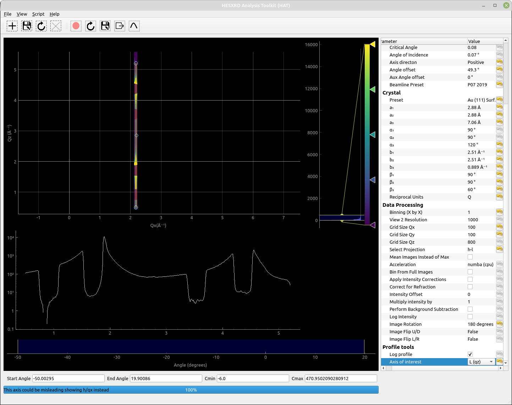
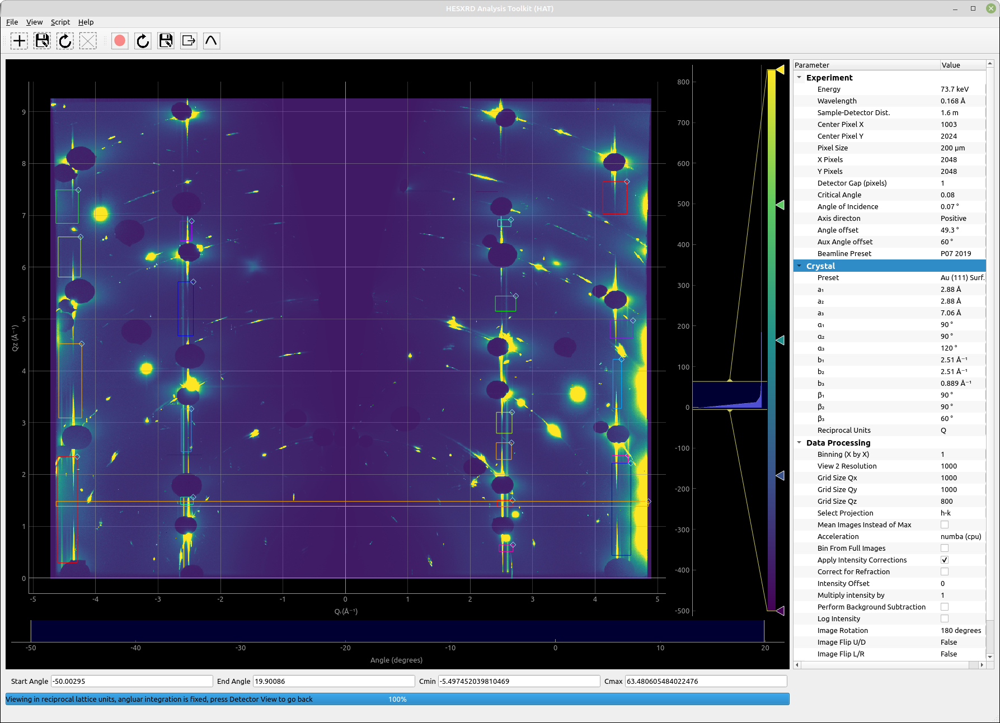
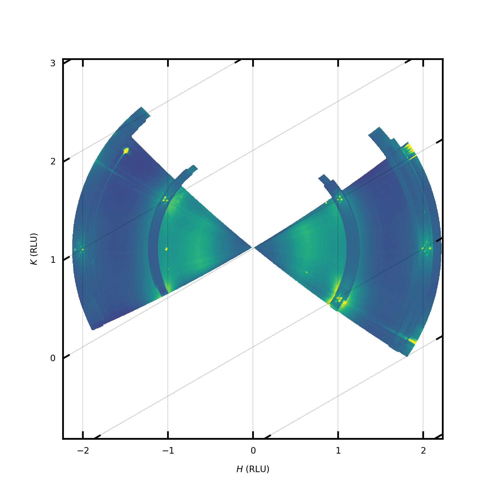
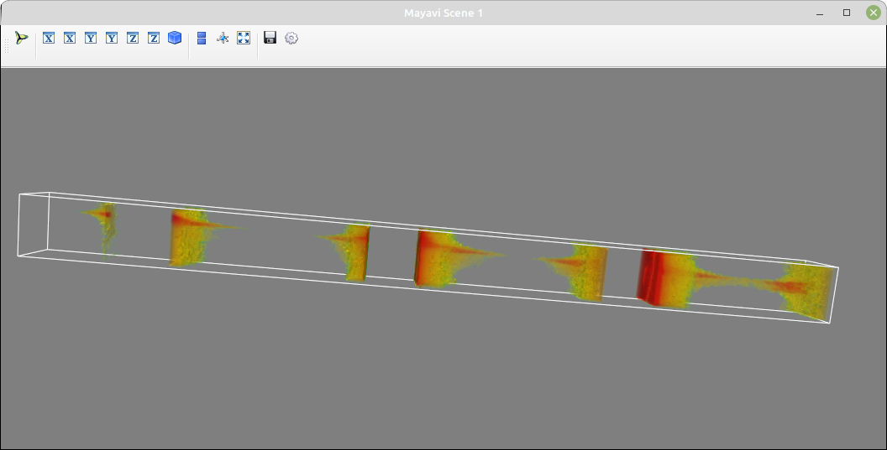
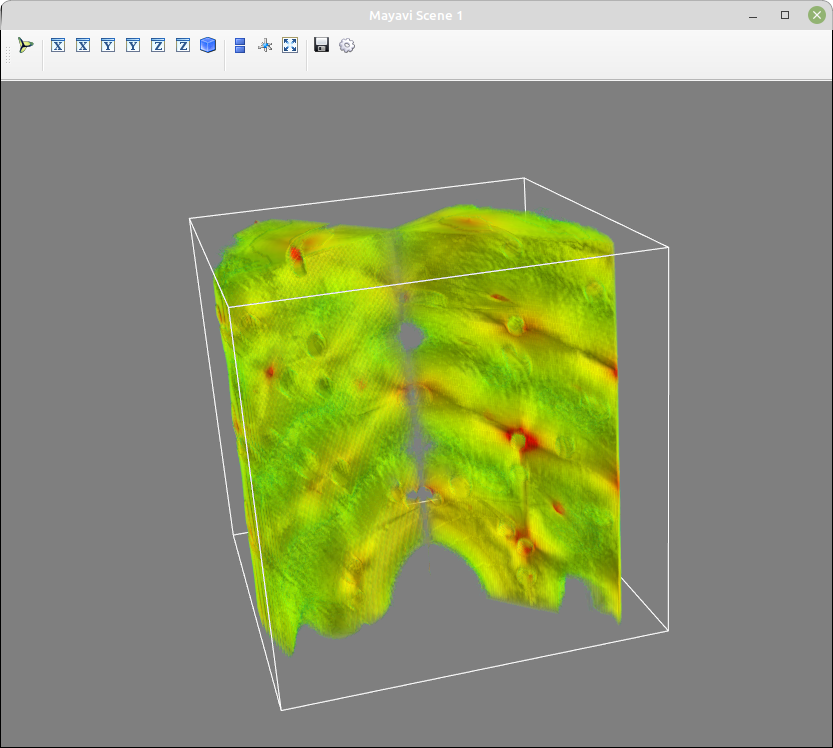
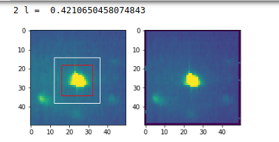
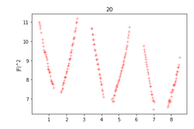

Beginner tutorial
=====================================
This tutorial will introduce some of the basic functionalities of HAT and generate some basic plots for a Au(111) surface in surface reciprocal lattice units.

.. toctree::
 :maxdepth: 1

Downloading and extracting example dataset
````````````````

An example dataset can be downloaded from the following addesss:

https://figshare.com/articles/dataset/Au_111_in_NaOH_High-energy_surface_x-ray_diffraction_dataset/20160632

The files are compressed with the 7zip format, in windows you will need software that can extract such files. Such a tool can be downloaded from here:

https://www.7-zip.org/download.html

In linux the following terminal command will download the dataset.

``wget https://figshare.com/ndownloader/files/36048185``

In linux you can usually use the 7za command to uncompress the file. Firstly check it is available::

  whereis 7za
  7za: /usr/bin/7za /usr/share/man/man1/7za.1.gz
  
You should then extract the data using the following command (replacing the number by the actualy filename):
 
``7za e ./36048185``

If it isn't found then you need to install it.

Install p7zip to unzip *.7z files on Debian and Ubuntu
......

``$ sudo apt-get install p7zip``

Install p7zip to unzip *.7z files on Fedora
......

``$ yum install p7zip``


Loading the data
````````````````
Start HAT, if you installed hat with pip (and you're in the correct enviroment) then at the terminal you can simply type:

``xrayhat``

Otherwise from the source directory you can run (you mayneed to replace python with python3):

``python main.py``

Next you should change the beamline preset in the parameter tree (right side of the window) to P07 2019. It is generally recommend you use the manual beamline preset as beamlines seem to be constantly chaning their file formats and HAT is unlikely to keep up. However, the chosen preset is known to work with this data. 

Next click on |File -> Select Data Images| and then find and select the .TIF images that you should have extracted above.

They should have names such as: "au_111_naoh_2_00023-00001.tif", one of the files is a dark image and this can be ignored. The compressed archive also contains .metadata files for each image, the P07 2019 preset will automatically handel this metadata. In particular it will read the angle values and an intensity monitor value. 

Next several parameters should be chosen under Experiment in the parameter tree.
The energy = 73.7 keV
Sample-Detector Dist. = 1.6m

Center Pixel X = 1003
Center Pixel Y = 2024

The number of pixels and size the pixel should be chosen correctly since we alreay selected the correct preset. The angle offset is to be determined later. But we no from the experimental geomtery that the direction is negative. 

Under crystall we can choose the Au(111) preset since the data was collected from a Au(111) sample. These will set the lattice parameters to the correct values for Au(111) in surface coordinates. 

In Data Proccessing we should select 180 degrees for Image rotation as the images are rotated. The binning value will depend on how much system RAM  is available, but since we are only quickly exploring the data - setting it to value of 4 or higher is a good idea.

Unless you know you have a GPU that is correctly setup acceleration should be set to "Numba (cpu)"

Now we can load the data, although it could be a good idea to save the file selection and parameters first so you can restore them if needed (File -> Quick Save). 

To load the data click on (File -> Load)


Detector View
````````````````
While the images are loading the view will update after every 100 images. After loading you should have a view that looks like the screenshot below. This is called the detecor view mode and can be accessed at anytime by clicking (View -> Detector View) or pressing CTRL+1.

.. image:: ./images/screenshot1.png


In this view the image is construsted from maximum intensity of each pixel accross the whole rotation. If instead you'd like the average intensity across the whole rotation you can do this by selecting "Mean Images instead of Max" under Data Processing in the parameter tree. 

From the toolbar, masks can be added. Mask are attached the view they are created in, for detector view the masks are exclusionary and can be used to reject pixels from later binning. This could be useful for excluding gaps between detector pixels or areas of the detector that are covered. 

If the "Toggle ROI" button is pressed on the toolbar a box profile is created and the profile shown in a panel below the detector view. The profile runs between the two draggable circles. "Save ROI" will save the shape and position of the ROI vox so the same profile can be used for multiple datasets. "Extract ROI" will save the profile to a csv file.

Transformed Detector View
````````````````
Since the HAT GUI currently doesn't support displaying in non-rectangular, we will need to work in Q units so the in-plane project we generate wont look distored. You can choosen this under "Reciprocal Units" in the parameter bar under Crystal. 

Next click the View menu and choose "Transformed Detector View" (ctrl+2). The current view will then be distored and have units on the axis as in the screenshot below.

.. image:: ./images/tutorial1.png

This view is our first opprtunity to select pixels to be included in any subsequent binning. Initally we want to make an in-plane map to find the orientation of the sample, so create a mask that selects a slice along Qr as shown in the screenshot. 

Next check that "h-k" is selected under "Select Projection"in the Data Processing section of the parameter menu.

We are going to create a projection of the selected slice on the Qx/Qy plane. Make sure there is sensible number chosen for the Qx and Qy gridsize (under Data Processing), 800 is a good number to start with.

Then Press: View -> Binned Projection (or ctrl+3)

Binned Projection
````````````````
The view you get should now look something like the screenshot below:

.. image:: ./images/tutorial2.png

This is probably a little distored since we have no idea about the sample orientation at this point, it's made harder to tell if the orientation is correct as we are using Q units. Therefore, we would like to plot this in-plane view in reciprocal lattice units (RLU) to see where the rods fall. For a hexagonal unit cell such as Au(111) we can can use the plotting.py interface. 

First you need to find where you installed the xrayhat package and located the file plotting.py. If you created a new enviroment on linux it will be somewhere like:

``<path to enviroment>/lib/python3.8/site-packages>/xrayhat/``

On windows or an anaconda installation it will be somewhere else. The easiest way to locate it is launching python from the terminal and doing something like this::

   Python 3.8.y
    [GCC 4.x] on linux
    Type "help", "copyright", "credits" or "license" for more information.
    >>> import xrayhat
    >>> xrayhat.__file__
    '/home/garyh/pyenvs/hat/lib/python3.8/site-packages/xrayhat/__init__.py'

The default plotting.py file is already setup to plot what we want, but in case it is missing you want to do something like below::

 def plot_projection_hk(hat, grid_h,grid_k,grid_i,cmin,cmax, outfile_name):  
     
     #define transformation for hexagonal coordinates
     b1 = hat.crystal.param('b₁').value()
     def tr(h, k):
         h, k = np.asarray(h), np.asarray(k)
         return (np.sqrt(3)/2)*h*b1,(k+0.5*h)*b1

     def inv_tr(x, y):
         x, y = np.asarray(x), np.asarray(y)
         return (x/(np.sqrt(3)/2))/b1,(y-0.5*x)/b1   


     plt.rcParams.update({'font.size': 4})
     plt.rc('legend', fontsize=8, handlelength=2)
     plt.rcParams.update({'font.sans-serif': 'Arial'})
     cm = 1/2.54  # centimeters in inches

     fig = plt.figure(figsize=(8*cm,8*cm),dpi=600)

     grid_helper = GridHelperCurveLinear((tr, inv_tr),grid_locator1=FixedLocator([-3,-2,-1,0,1,2,3]),grid_locator2=FixedLocator([-3,-2,-1,0,1,2,3]))

     ax1 = Subplot(fig, 1, 1, 1, grid_helper=grid_helper)
     #ax1 = Subplot(fig, 1, 1, 1,)
     fig.add_subplot(ax1)
     grid_i = grid_i.T.astype(float)
     grid_i[grid_i <= 1] = np.nan  

     tmp = ax1.imshow(grid_i, extent=(np.min(grid_h),np.max(grid_h),np.min(grid_k),np.max(grid_k)), origin='lower',vmin=cmin,vmax=cmax,cmap='viridis',interpolation='gaussian')  

     ax1.grid(True,linewidth=0.05,color='black')
     ax1.xaxis.set_major_locator(ticker.MultipleLocator(1))
     ax1.yaxis.set_major_locator(ticker.MultipleLocator(1))

     plt.xlabel('$H$ (RLU)')
     plt.ylabel('$K$ (RLU)')

     plt.savefig(outfile_name)
     plt.close()
     print("Plotting complete")
       
It is clear that the CTRs do not align with the axis grid, to fix this we need to change the "Anlge offset" value under 'Experiment' in the parameter tree so that is does. This is an iterative process where you change the value, and press View-> Binned Projection again until it does match. 

For the sake of the tutorial you should put in 49.3 for the angle offset. Your outputted figure will look something like:

.. image:: ./images/tutorial3.png

Although this looks fairly reasonable we still aren't actually sure if it is the correct orientation. The surface as 120 degree rotational symmetry but lattice points are found every 60 degrees so it could be the the reciprocal space map is 60 degrees off. To check this we need to look at where the Bragg 
peaks fall on a CTR. 

First we choose a CTR, add a new mask around the CTR currently located a (1 0), this is unique to the Qx/Qy projection. As shown:

.. image:: ./images/tutorial4.png

Next we want to go back to the transformed projection view (ctrl+2)  and select the entire Qz range, i.e. 

.. image:: ./images/tutorial5.png

At this point any pixels that fall in BOTH our two masks will be included in any hl, kl, or 3d binning. We will generate a hl projection to see where the Bragg peaks fall. Since our in-plane box is very small in the Qx/Qy directions it does not make much sense to have a large grid as there would be many empty pixels. So we change Grid Size Qx and Qy each to 100, as well as 'Select Projection' to HL (under Data Processing). 

Press View -> Binned Projection 

We will now see a HL projection containing our (10) CTR. Next we take a profile along the CTR:
 1) First select "L(qz)" as the axis of interest under Profile Tools in the parameter tree. 
 2) Then press the "Toogle ROI" toolbar button (red circle)
 3) Drag the profile box so that the two circles are at each end of the CTR. 
  

 
From this the Bragg peaks that are masked by the beamstops lie at Qz ~ 1.7 and Qz ~ 4.5. If we divide these by b3 (0.889) we get the reciprocal lattice space positions 1.9 and 5.0. Since we are only estimating the position of the Bragg peaks here it is not too important. This rod then has Bragg peaks at 2 and 5 in surface units and they are seperated by 3 RLU as one would expect given the ABC stacking. However, for (10) rod the Bragg peaks should be at 1,4, and 7. Therefore, our orientation is incorrect by exactly 60 degrees.

To correct this we can either add 60 to 49.3 and put 109.3 in the angle offset or instead change the Aux Angle offset to 60 degrees. 


Making a nice in-plane map
````````````````
Now we have the sample orientation correct we can start to make some figures. 

We can go back to transformed detector view and just select the parts around the CTRs we wish to include. Plus a full horizontal slice so that we have a background between the CTRs. 



We can increase the Grid Size Qx and Qy to 1000, and again select h-k projection from the parameter menu. Then click View -> Binned projection. After it is complete one can run plotting.py (F6) and hopefully get something that looks like this:



CTR Extraction
````````````````
Here we will export a CTR to a 3d grid and extracting it with a python script. 

1) We should raw a mask around the CTR in the in-plane view as before, there should be enough background around the CTR to be able to perform background subtraction. For this we have chosen the (20) CTR.

2) In the transformed detector view, make sure all parts of the CTRs you might be interested in are included. 

3) Select an appropriate grid size, this can't be too big since for a 3d grid you will quickly run out of memory. If Qx and Qy have big grids it is likely not every voxel will be populated since we only selected a small box around the CTR in Qx and Qy. If Qz is large it can be okay, but it does mean you will have many points along the CTR. Here we have selected 30 for Qx and Qy and 400 for Qz. We should also enable apply intensity corrections in the parameter tree. 

3) To check with can create a h-l projection. The profile along this projection includees the CTR profile, and if you are able to take representive background regions either side it could be used to directly extract the CTR profile. 

.. image:: ./images/tutorial9.png

4) Click View -> Export 3d Data

This will take a little time, afterwhich you can save a 3d grid to a .npz file. 


Viewing CTR in 3D
````````````````
Lets create a new enviroment for mayavi since it uses pyqt5 and this could cause conflicts with pyqt6 that HAT need, in linux we would do the following:

``$ python3 -m venv mayavi``

Then we should activate the enviroment:

``$ source mayavi/bin/activate``

Next we should install myavi and some libraries:

``$ pip install wheel numpy mayavi pyqt5``

And then we can run the following code to plot our data in 3d::

 import mayavi.mlab as mlab
 import numpy as np

 filename = "au111_10_3d_30_30_400.npz"
 background = 70
 cmin= 0
 cmax = 5.5

 #create a simple logarithmic 3d plot of the CTR
 data=np.load(filename)['data']

 #take a background and set it to a small number but not zero
 b = np.where(data < background, 0.0000001, data)
 print(np.min(b))
 b =np.log(b)

 #show in mayavi
 mlab.pipeline.volume(mlab.pipeline.scalar_field(b),vmin=cmin, vmax=cmax)
 mlab.outline()
 mlab.show()
 


It is somewhat noticeable that the CTR still curves a bit towards the top and this is due to the sample being somewhat misaligned. It can be fixed by optimising the various parameters such as angle offset, angle of incidence, sample-detector distance and the Center Pixel. Alternatively (as with this data) the sample was not accurately aligned durng the experiment. However, it is still possible to extract the CTR data as in the next section. 

Further information about plotting with mayavi can be found on their site:

https://docs.enthought.com/mayavi/mayavi/

It can also be useful to visualise larger volumes of reciprocal, this is for example the entire volume collected in the dataset:




CTR Exraction II
````````````````
We'd now like to take slices along our extracted data and extract the CTR intensity, you can use whatever package or programming language you prefer here as long as it can read .npz files. Here we will use python and run the following code segments to take slices of our 3d data. Then for each slice we take a region for our signal and background. The background is thenscaled and subtracted from the CTR signal. 

First we should load the data and import the libraries::

 # this is a script to integrate a CTR froma 3d grid
 import numpy as np
 import matplotlib.pylab as plt
 import lmfit
 from lmfit.lineshapes import gaussian2d, lorentzian
 import cv2
 import matplotlib.patches as patches
 import scipy.ndimage
 import scipy.interpolate
 import pdb

 cm = 1/2.54

 file = "/home/garyh/pyenvs/au111_20_3d_50_50_400.npz"
 data = np.load(file)['data']
 zaxis = np.load(file)['z'][0]
 
Next we define some useful parameters::

  #list of image numbersw to ignore
 ignore = [6,8,9,324]#+list(range(266,296))
 values = []
 ls=  []

 #parameters
 lbraggs=[0,3,6,9] #list of where the bragg peaks are
 min_dist_to_bragg = 0.4 #we will ignore points closer to the bragg peak
 b3=0.889 #reciprocal lattice constant to convert Q to RLU
 l_cutoff = 8.5  #ignore l values above this
 miniuim_intensity = 600 #minium intensity values

 #roi and backgrounds
 width = 16
 height = 16
 background = 8

Now we loop through each slice image and extract the data::

 for i in range(np.shape(data)[2]): 

     extract = True
     l = zaxis[i]/b3

     #check ignore list
     if i in ignore:
         extract = False
     elif l > l_cutoff:
         extract = False    

     #fliter out points close to the bragg peaks
     for bragg in lbraggs:
         if abs(l-bragg) < min_dist_to_bragg:
             extract = False

     if extract:
         print(i,"l = ",l)
         z=  data[:,:,i]
         mask = ~(z == 0)

         # array of (number of points, 2) containing the x,y coordinates of the valid values only
         xx, yy = np.meshgrid(np.arange(z.shape[1]), np.arange(z.shape[0]))
         xym = np.vstack((np.ravel(xx[mask]), np.ravel(yy[mask]))).T

         data0 = z[mask]
         if len(data0) < 2:
            continue

         interp0 = scipy.interpolate.NearestNDInterpolator( xym, data0 )
         result0 = interp0(np.ravel(xx), np.ravel(yy)).reshape( xx.shape )   

         #index with highest intensity
         indy,indx = np.unravel_index(np.argmax(result0 , axis=None), z.shape)


         xval = (int(indx - width/2-background/2),int(indx+width/2+background/2))
         yval = (int(indy -height/2-background/2),int(indy+height/2+background/2))

         signal_with_bkground = np.sum(result0[yval[0]:yval[1],xval[0]:xval[1]])

         signal = np.sum(result0[int(indy-height/2):int(indy+height/2),int(indx- width/2):int(indx+ width/2)])

         signal_size = width*height
         combined_size = (width+background)*(height+background)
         difference =combined_size-signal_size 
         normalise = signal_size/difference
         background_sig = (signal_with_bkground - signal)*normalise
         signal_i = signal - background_sig

         if signal_i > miniuim_intensity:                     
             fig, axs = plt.subplots(1,2)
             ax = axs[0]
             ip1 = ax.imshow(result0,vmin=0,vmax=400)
             rect = patches.Rectangle((indx - width/2, indy-height/2), width, height, linewidth=1, edgecolor='r', facecolor='none')
             rect2 = patches.Rectangle((indx - width/2-background/2, indy - height/2-background/2),
                                       width+background, height+background, linewidth=1, edgecolor='g', facecolor='none')

             # Add the patch to the Axes
             ax.add_patch(rect)
             ax.add_patch(rect2)

             ax = axs[1]
             ip = ax.imshow(z,vmin=0,vmax=500)

             values.append(signal_i)
             ls.append(zaxis[i])
             plt.show() 



The above script will output two images for each slice, left image is the slice witht he regions for signal and background shown. The right image shows the slice after interpolation, which can fix any gaps in the gap caused for instance by the binning resolution. One should then inspect the images to make sure all the regions are inside the data and don't contain any artifacts that could lead to a false signal. In the above script one can add slices to exclude by putting the index in the ignore list. 

Next we can plot the CTR::
  #plot CTR
  plt.plot(np.asarray(ls)/0.889,np.log(values),'r+',alpha=.5)
  plt.ylabel('|F|^2')
  plt.title('20')
 



 
       
                                                                
      


